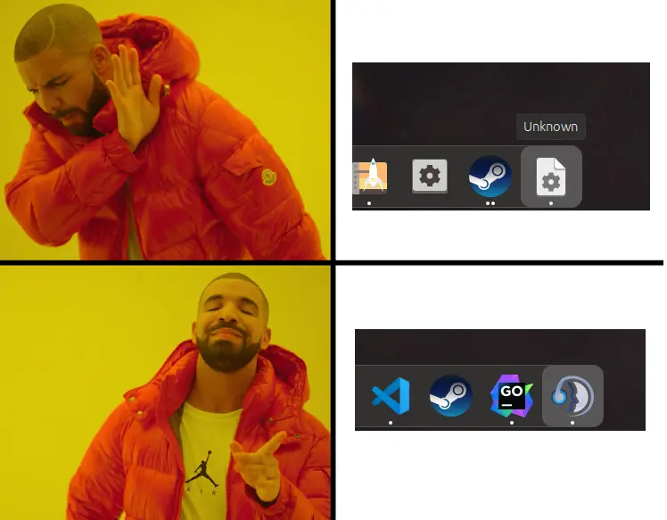

# tswm

A 'little' wrapper that sets TeamSpeak 5's WM_CLASS window property so the icon will be displayed in Gnome. It ain't stupid if it works, I guess.



## teamspeak-client.desktop

You need to update your desktop configuration file.

```
[Desktop Entry]
Version=1.0
Type=Application
StartupNotify=false
Name=TeamSpeak
Icon=teamspeak-client
Comment=TeamSpeak Voice Communication Client
Categories=AudioVideo;Chat;Network;
StartupWMClass=TeamSpeak
MimeType=x-scheme-handler/ts3server;x-scheme-handler/teamspeak;
Exec=/opt/teamspeak-client/tswm %u
Path=/opt/teamspeak-client/
```